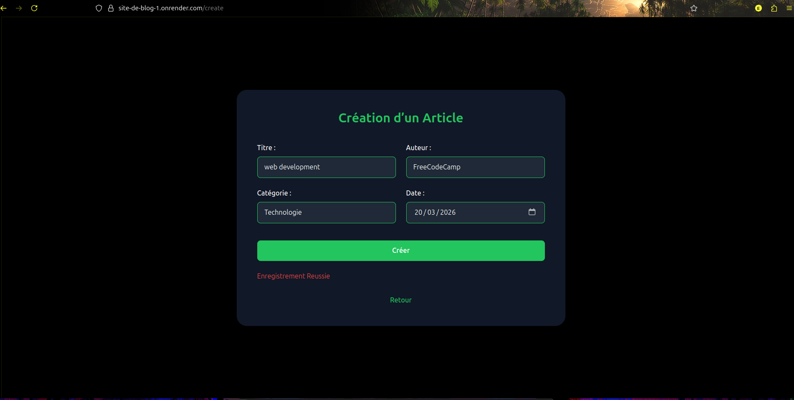
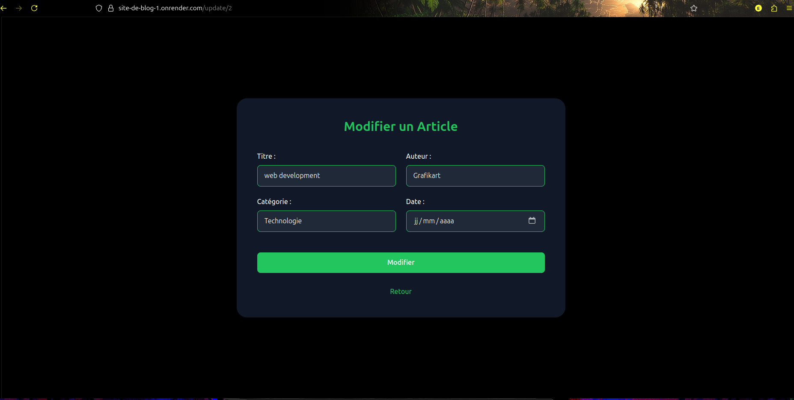
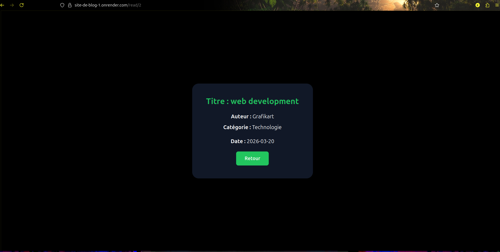
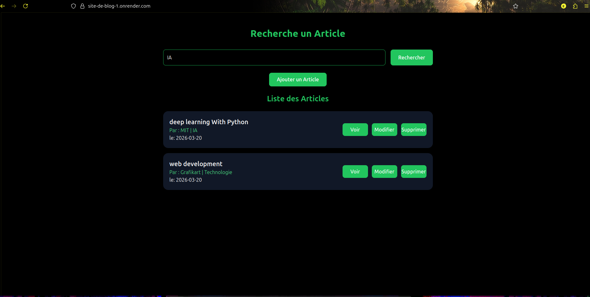
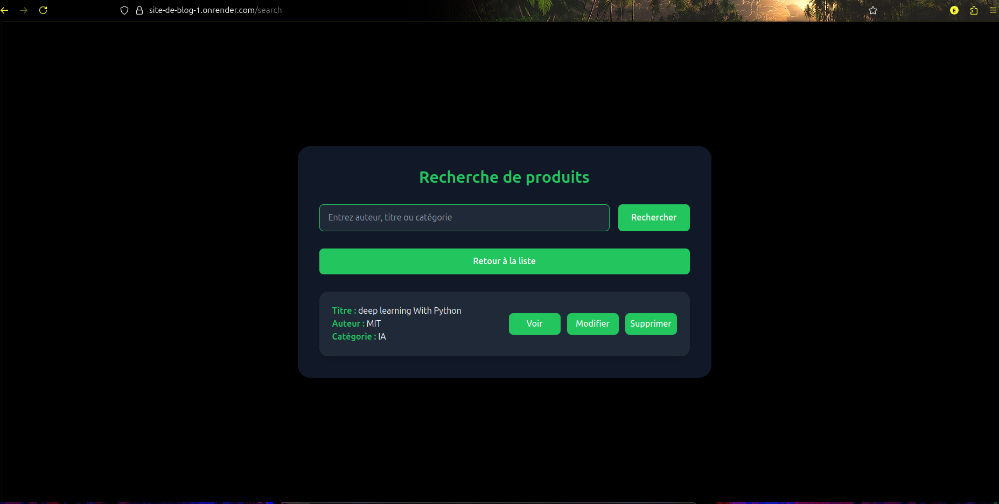
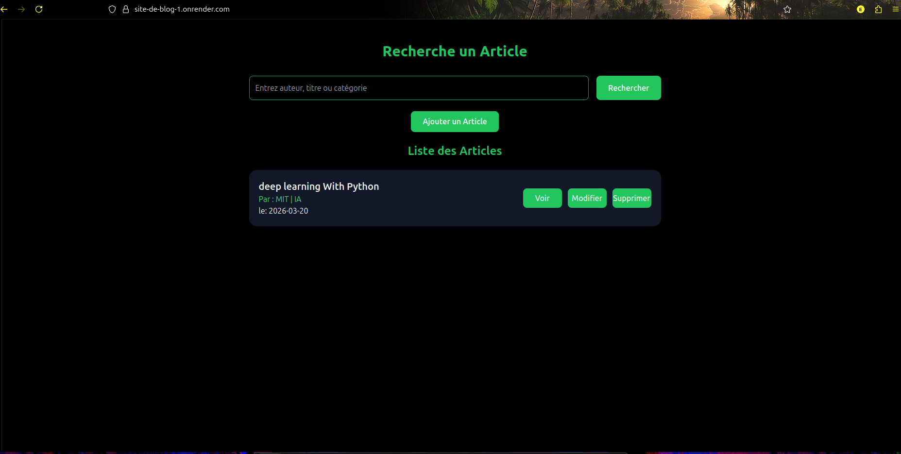

# 1. Page d’Accueil
🔗 Lien : 

---

# 2. Création de l’Article "Web Development"
🔗 Lien : 
🔗 Lien : 

---

# 3. Modification de l’Auteur (FreeCodeCamp ➝ Grafikart)
🔗 Lien : 
🔗 Lien : 

---

# 4. Affichage de l’Article "Web Development"
🔗 Lien : 

---

# 5. Recherche des Articles de Catégorie "IA"
🔗 Lien : 
🔗 Lien : 

---

# 6. Suppression de l’Article "Web Development"
🔗 Lien : 
